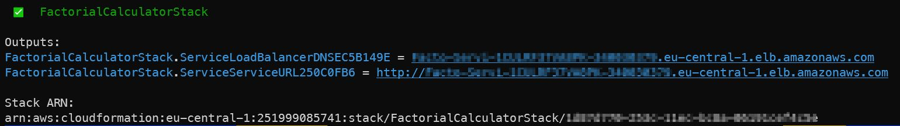
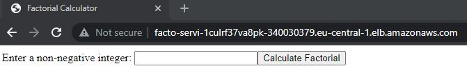

# Sample Factorial Calculator with AWS Cloud Development Kit (CDK)

A simple Dockerized application calculating the factorial of non-negative integer numbers.

This application is hosted on Fargate behind a Load Balancer.

Among all the alternatives like ECS, EKS, and Fargate, I chose Fargate for hosting this application in order to continue the recent Serverless approach as in other project *serverless-cdk*

Apparently, AWS provides a module called [ecs-patterns](https://docs.aws.amazon.com/cdk/api/latest/docs/aws-ecs-patterns-readme.html) (in addition to the generic [ecs](https://docs.aws.amazon.com/cdk/api/latest/docs/aws-ecs-readme.html) module) which is providing some boilerplate functions to cover a couple of popular use cases.
So I used that module to setup the Fargate service.

The whole project is developed by using AWS Cloud Development Kit (CDK), and the calculator is implemented as a minimal Javascript application.

### Prerequisites:
* [AWS CLI](https://docs.aws.amazon.com/cli/latest/userguide/install-cliv2-linux.html)
* An AWS user with Administrator Access:  
Run `aws configure` with the credentials of this user before running the project
* [Node.js](https://github.com/nodesource/distributions/blob/master/README.md)
* AWS CDK Toolkit:
```
npm install -g aws-cdk
```
* Python3  

<br>In order to test this project locally, follow those steps:

```
$ git checkout https://github.com/miynat/docker-on-fargate-cdk.git
$ cd serverless-cdk
```

Create a Python virtualenv, and activate it:

```
$ python3 -m venv .venv
$ source .venv/bin/activate
```

Then install the required dependencies.

```
$ pip install -r requirements.txt
```

Deploy the code to AWS with CDK:

```
$ cdk deploy --require-approval never
```

CDK will build our Docker image, will push the produced Docker image onto Amazon ECR (Amazon Elastic Container Registry), and then deploy the Fargate service by using the image from ECR.

Once the project is deployed on AWS, we will see the URL of the Load Balancer of our service in the output:



Copy that URL, paste it on a browser, and you will see our mini Factorial Calculator program:


